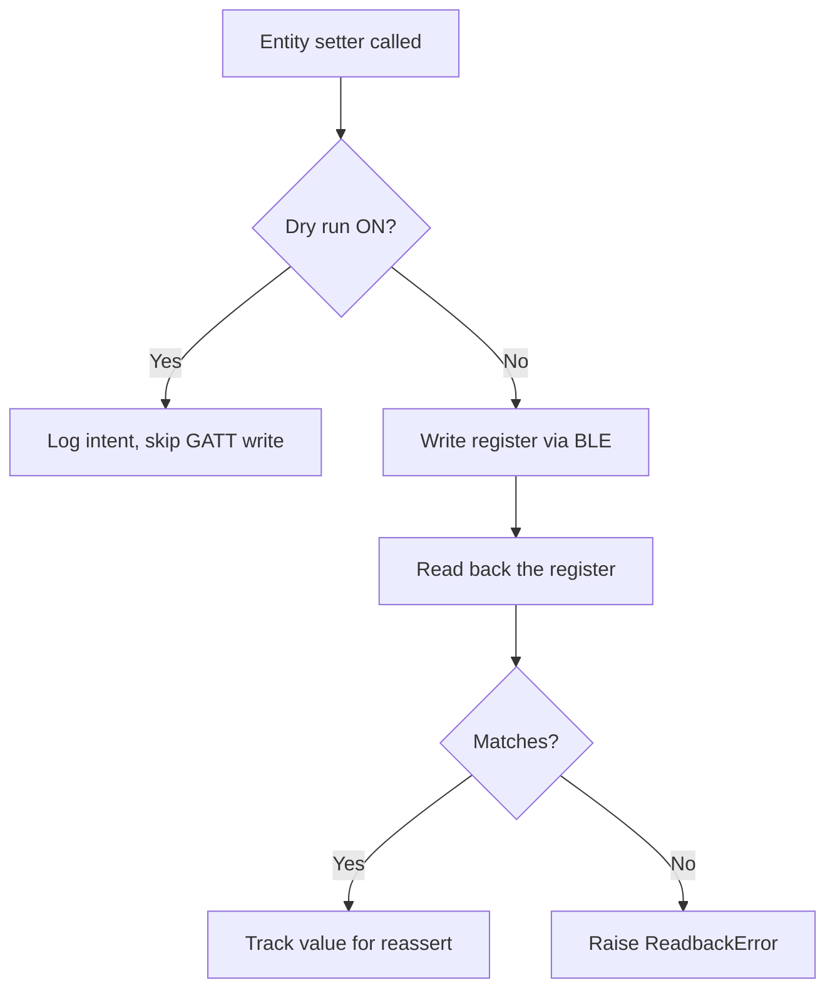
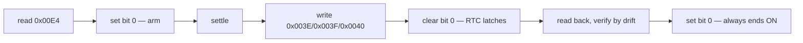

# Deye Bluetooth (Local) — Home Assistant Integration

Local control of a Deye hybrid inverter over **Bluetooth Low Energy**, with **no
cloud dependency**. This integration reads all telemetry and writes all controls
directly to the inverter's logger stick via BLE, using the same Modbus registers
as the Deye Cloud.

## Architecture

```mermaid
graph LR
    subgraph Phone
        A[Deye App]
    end
    subgraph Home Assistant
        B[deye_ble<br/>integration]
        C[ha-deyecloud-bridge<br/>cloud integration]
    end
    D[Logger Stick<br/>BLE service 0x0922]
    E[Inverter<br/>Modbus registers]
    F[Deye Cloud]

    A <-->|BLE exclusive| D
    B <-->|BLE (Modbus over AT)| D
    C -->|MQTT/TLS| F
    F -->|Modbus over MQTT| D
    D ---|Modbus| E
```

> **One BLE central at a time.** The logger stick accepts a single BLE
> connection — the phone Deye app and this HA integration cannot both connect
> simultaneously. Close the Deye phone app before using the BLE integration.

## Running alongside the cloud bridge

This integration is designed to run **in parallel** with
[`ha-deyecloud-bridge`](https://github.com/PetePeter/ha-deyecloud-bridge).
Both report the same telemetry keys with the same scaling — the BLE device is
registered as **"Deye Inverter (BLE)"** (distinct from the cloud bridge's
"Deye Inverter"), so entity IDs and device registry entries never collide.

Use the
[parallel-run validation checklist](docs/validation.md) to compare values
side-by-side and confirm correctness before considering a future switchover.

**No cutover is performed by this integration.** The cloud bridge is left
running and untouched.

## Installation (HACS)

1. Add this repository as a [custom repository](https://hacs.xyz/docs/use/integrations/#add-custom-repositories)
   in HACS → Integrations: the repository URL.
2. Download the integration through HACS.
3. Restart Home Assistant.
4. Go to **Settings → Devices & Services → Add Integration** and search for
   **Deye Bluetooth (Local)**.

## Deployment & updating

This integration is distributed **only** through HACS as a custom repository —
there is no separate build, server, or copy-to-host step. It currently ships
**no GitHub releases or tags**, so HACS tracks the `master` branch HEAD. In
practice that means **pushing to `master` is the deploy**: the new code is live
to anyone who redownloads.


To roll out a change to an installed instance:

1. `git push` to `master` (done by the maintainer).
2. On the HA box: **HACS → Deye Bluetooth (Local) → ⋮ → Redownload** and pick
   the `master` branch.
3. **Restart Home Assistant** (Settings → System → Restart) — Python
   integrations are only reloaded on restart.

> **Optional, for versioned releases:** bump `version` in
> `custom_components/deye_ble/manifest.json` and publish a matching GitHub
> release/tag. Once any release exists, HACS switches from branch-tracking to
> offering the tagged versions instead.

## Configuration

The config flow supports two paths:

| Path | Description |
|------|-------------|
| **BLE Discovery** | If the logger is advertising nearby, HA discovers it automatically via service UUID `00000922-...`. Confirm by entering the logger serial number. |
| **Manual** | Pick a discovered BLE device from the list, then enter the logger serial number. |

The **logger serial number** (e.g. `DEYE00000001`) is the BLE advertised name
printed on the logger stick. It becomes the config entry's unique identifier and
drives all entity unique IDs.

### Options (dry-run & reassert)

After setup, **Settings → Devices & Services → Deye Bluetooth (Local) → Options**
exposes two safety toggles:

| Option | Default | Description |
|--------|---------|-------------|
| **Dry Run** | ON | Blocks all GATT writes; logs what *would* be written. No values are sent to the inverter. |
| **Reassert** | OFF | If a cloud/app write changes a register that HA last set, re-apply the HA value on the next poll cycle. |

## Safety model

Writes to a live inverter are inherently risky. This integration uses a layered
approach:



1. **Dry-run default** — all writes are blocked until the user explicitly
   disables dry-run in the integration options. This means the integration
   installs as **read-only** by default.
2. **Read-back verify** — every write is followed by an immediate register
   read. If the read-back doesn't match, a `ReadbackError` is raised and the
   optimistic entity update is reverted.
3. **Opt-in reassert** — when enabled, the coordinator detects if a tracked
   control register has drifted (e.g. the cloud bridge or phone app changed
   it) and re-applies the last HA-set value.

## Entities

### Sensors (29 + 1 derived)

| Key | Name | Unit | Source register |
|-----|------|------|-----------------|
| `solar_power` | Solar Power | W | `0x02A0` |
| `house_load` | House Load | W | `0x0283` |
| `grid_power` | Grid Power | W | `0x025F` |
| `battery_power` | Battery Power | W | `0x024E` |
| `ups_power` | UPS Power | W | `0x028D` |
| `battery_soc` | Battery SOC | % | `0x024C` |
| `battery_voltage` | Battery Voltage | V | `0x024B` |
| `battery_temp` | Battery Temperature | °C | `0x024A` |
| `inverter_temp` | Inverter Temperature | °C | `0x021D` |
| `daily_solar` | Solar Today | kWh | `0x0211` |
| `daily_grid_import` | Grid Import Today | kWh | `0x0208` |
| `daily_grid_export` | Grid Export Today | kWh | `0x0209` |
| `total_solar` | Solar Total | kWh | `0x0216` |
| `total_grid_import` | Grid Import Total | kWh | `0x020A` |
| `total_grid_export` | Grid Export Total | kWh | `0x020C` |
| `total_battery_charge` | Battery Charge Total | kWh | `0x0204` |
| `total_battery_discharge` | Battery Discharge Total | kWh | `0x0206` |
| `max_sell_power` | Max Sell Power | W | `0x008F` |
| `inverter_power_l1` | Inverter Output L1 | W | `0x0279` |
| `inverter_power_l2` | Inverter Output L2 | W | `0x027A` |
| `inverter_power_l3` | Inverter Output L3 | W | `0x027B` |
| `grid_voltage_l1` | Grid Voltage L1 | V | `0x0273` |
| `grid_voltage_l2` | Grid Voltage L2 | V | `0x0275` |
| `grid_voltage_l3` | Grid Voltage L3 | V | `0x0274` |
| `grid_frequency` | Grid Frequency | Hz | `0x0261` |
| `bms_charge_voltage` | BMS Charge Voltage | V | `0x00D2` |
| `bms_discharge_voltage` | BMS Discharge Voltage | V | `0x00D3` |
| `bms_charge_current_limit` | BMS Charge Current Limit | A | `0x00D4` |
| `bms_discharge_current_limit` | BMS Discharge Current Limit | A | `0x00D5` |
| `daily_consumption` | Consumption Today | kWh | derived from `0x020F` |
| `inverter_clock` | Inverter Clock | — | `0x003E`–`0x0040` (diagnostic) |
| `clock_sync_result` | Clock Sync Result | — | last `sync_clock` outcome — `ok` / `skipped` / `failed` / `clock_wrong`, with `sync_id`/`sync_attempts`/`sync_at` |
| `inverter_clock_drift` | Inverter Clock Drift | s | derived — snapshot taken at each clock read |
| `inverter_time_of_day_drift` | Inverter Clock Drift (Time of Day) | s | derived — date ignored, wrapped to ±12 h |

> Grid voltage phase order is L1, L3, L2 across `0x0273`–`0x0275`; only L2
> (`0x0275`) was directly cross-checked against the app.

### Binary sensors

| Entity | Source | Description |
|--------|--------|-------------|
| `binary_sensor.grid_connected` | inferred from grid voltages | On when any grid phase is energised (>100 V); off when all phases collapse. No verified relay register, so it is derived rather than read. |
| `binary_sensor.cloud_clock_sync_enabled` | `0x00E4` bit 0 | Time Sync — when off, the inverter accepts no cloud clock calibration and its RTC free-runs. Setting the time from the Deye app leaves this off silently; that is how the clock ended up a year out. |

### Controls

| Platform | Entity | Register | Description |
|----------|--------|----------|-------------|
| `number` | Max Sell Power | `0x008F` | Grid export power limit (0–15 000 W) |
| `number` | Charge Target SOC | `0x00A7` | Battery charge ceiling — slot 2 / charge window (%) |
| `number` | Discharge SOC | `0x00A6`,`0x00A8`–`0x00AB` | Discharge floor — written to every non-charge TOU slot (%) |
| `number` | Grid Peak Shave Power | `0x00BF` | Max grid import while grid peak shaving is on (W) |
| `number` | Gen Peak Shave Power | `0x00BE` | Max generator power while gen peak shaving is on (W) |
| `select` | Work Mode | `0x008E` | Selling First / Zero Export to Load / Zero Export to CT |
| `switch` | Grid Peak Shaving | `0x00B2` bit 4 | Enable grid peak-shaving (read-modify-write of the packed flag register) |
| `switch` | Gen Peak Shaving | `0x00B2` bit 2 | Enable generator peak-shaving (read-modify-write of the packed flag register) |
| `time` | Grid Charge From | `0x0095` | Charge window start time |
| `time` | Grid Charge To | `0x0096` | Charge window end time |

### Intentionally not implemented

| Entity | Reason |
|--------|--------|
| `discharge_soc` (dedicated register) | No standalone register — implemented instead via the TOU non-charge slot SOCs (see Discharge SOC control) |

## Services

| Service | Description |
|---------|-------------|
| `deye_ble.dump_registers` | Diagnostic read-only sweep of holding registers to `/config/deye_register_dump.txt`. Args: `start`, `end`, `block`. |
| `deye_ble.sync_clock` | Sets the inverter RTC to HA's local time, then refreshes so the entities reflect the result before the call returns. Optional `min_drift` (seconds) makes it a check that only writes when drift exceeds the threshold; called without it, it always syncs. Honours dry-run. |

`sync_clock` is a sequence, not a write: the RTC commits its staged registers
only when Time Sync (`0x00E4` bit 0) falls from on to off.



Four properties are load-bearing, and each is paid for in evidence
(`local-deye-cloud/docs/inverter-clock-2026-08-09.md`):

- **The sequence always ends with Time Sync ON** — it does not restore the flag
  to whatever it was. Time Sync off means the logger's cloud calibration cannot
  reach the RTC, which is how the phone app silently broke the clock; finding it
  off is a fault to repair, not a preference to preserve. It also matters for
  safety: a final write of a *cleared* bit would itself be a falling edge, and
  if an error had interrupted the three clock writes it would latch a mixture of
  new and stale words — a new date against an old time. Ending on a rising edge
  cannot commit anything, so that failure mode does not exist.
- **One lock for the whole sequence, one session per attempt.** The lock keeps
  polls out of an open commit window; the fresh session per attempt means a link
  that has just errored never carries the next attempt.
- **Verified by drift, not equality.** The clock ticks while the sequence runs,
  so the read-back is compared against a freshly taken "now" with a 90 s
  tolerance, and the target is re-derived on every retry. An undecodable
  read-back is a failure.
- **The read-back must be FRESH.** The logger caches read responses for a
  variable window of at least 8 s (see [`docs/protocol.md`](docs/protocol.md)),
  so a read taken just after a write can return a pre-write frame — which
  decodes to a plausible time and would report success over a corrupted RTC.
  Verification therefore discards frames identical to the one before them and
  requires two consecutive *distinct* in-tolerance frames, because the cache can
  refresh a moment before a write lands and produce one genuinely-new frame that
  still predates it.
- **A clock verified wrong is not the same as one that could not be verified.**
  The first is evidence and earns a bounded extra push (nothing else corrects
  this RTC, so giving up leaves the inverter on a bad date); the second is an
  absence of evidence and does not. If the extension ends with the clock still
  wrong, that is published as `clock_wrong` and alerted distinctly — a bad date
  reported as a generic failure is the same silent-failure shape again.
- **The outcome is published, not inferred.** `sensor.…_clock_sync_result`
  reads `ok`/`failed` and carries `sync_id`, `sync_attempts` and `sync_at`. It
  is its own entity, always available, because every other entity reports what
  the device currently says and goes unavailable when polling fails — taking
  its attributes with it. What we know about a finished sync stays true when
  the radio drops. Verify by comparing `sync_id` against the value seen before
  the call: a timestamp comparison would assume a monotonic wall clock, and
  drift is a snapshot carried forward on a failed read, so both can report a
  good sync as a failure.

[`deploy/deye_clock.yaml`](deploy/deye_clock.yaml) drives it daily at 08:00 site
time, which also carries the DST step onto the inverter's timezone-less clock.

## Testing

See [`docs/testing.md`](docs/testing.md) for the testing discipline this
integration is held to — mutation-checking every behaviour, what a mutation
report must distinguish, and how fakes are allowed to model hardware. Each rule
there was paid for by a bug a green suite did not catch.

## Protocol

See [`docs/protocol.md`](docs/protocol.md) for the full reverse-engineered BLE
framing specification (AT commands, Modbus wrapping, CRC, register map).

## Credits

Protocol reverse-engineered from a cloud TLS/MQTT MITM capture and an Android
BLE HCI snoop. Built with Claude Code.
