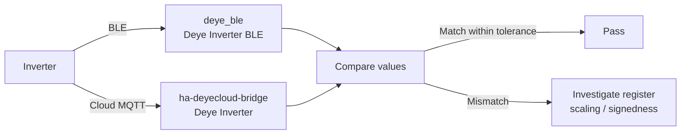

# Parallel-Run Validation Checklist

Run `deye_ble` and `ha-deyecloud-bridge` side by side, then compare entity
values to confirm the BLE integration reports correct data. **Do not disable or
remove the cloud bridge** — switchover is a separate future task.

## Validation flow



## Entity comparison table

Compare each `sensor.deye_inverter_ble_*` against the corresponding
`sensor.deye_inverter_*` from the cloud bridge. Record the values at the same
time (or within a few seconds for fast-changing power values).

### Telemetry sensors (read)

| BLE entity key | Cloud bridge entity | Tolerance | Notes |
|---|---|---|---|
| `solar_power` | `sensor.deye_inverter_solar_power` | ±50 W | Fast-changing; sample at same second |
| `house_load` | `sensor.deye_inverter_house_load` | ±50 W | Fast-changing; sample at same second |
| `grid_power` | `sensor.deye_inverter_grid_power` | ±50 W | Fast-changing; signed (negative = export) |
| `battery_power` | `sensor.deye_inverter_battery_power` | ±50 W | Fast-changing; signed (negative = charging, positive = discharging) |
| `ups_power` | `sensor.deye_inverter_ups_power` | ±50 W | Fast-changing |
| `battery_soc` | `sensor.deye_inverter_battery_soc` | **exact** | Slow-changing; should match precisely |
| `battery_voltage` | `sensor.deye_inverter_battery_voltage` | ±0.5 V | Slow-changing |
| `battery_temp` | `sensor.deye_inverter_battery_temperature` | ±1.0 °C | Slow-changing |
| `inverter_temp` | `sensor.deye_inverter_inverter_temperature` | ±1.0 °C | Slow-changing |
| `daily_solar` | `sensor.deye_inverter_solar_today` | **exact** | Accumulates during the day |
| `daily_grid_import` | (no direct cloud counterpart) | — | Cloud reports `daily_consumption` instead |
| `daily_grid_export` | (no direct cloud counterpart) | — | Cloud bridge does not expose daily grid export separately |
| `total_solar` | `sensor.deye_inverter_solar_total` | **exact** | Lifetime total; should match precisely |
| `total_grid_import` | `sensor.deye_inverter_grid_import_total` | **exact** | Lifetime total |
| `total_grid_export` | `sensor.deye_inverter_grid_export_total` | **exact** | Lifetime total |
| `total_battery_charge` | `sensor.deye_inverter_battery_charge_total` | **exact** | Lifetime total |
| `total_battery_discharge` | `sensor.deye_inverter_battery_discharge_total` | **exact** | Lifetime total |
| `max_sell_power` | `number.deye_inverter_max_sell_power` | **exact** | Control register read-back |
| `inverter_power_l1` | `sensor.deye_inverter_inverter_power_l1` | ±50 W | Fast-changing |
| `inverter_power_l2` | `sensor.deye_inverter_inverter_power_l2` | ±50 W | Fast-changing |
| `inverter_power_l3` | `sensor.deye_inverter_inverter_power_l3` | ±50 W | Fast-changing |

### Derived sensor

| BLE entity key | Cloud bridge entity | Tolerance | Notes |
|---|---|---|---|
| `daily_consumption` | `sensor.deye_inverter_consumption_today` | ±0.5 kWh | BLE derives this from the lifetime `total_consumption` register (`0x020F`) minus a midnight baseline, mirroring the cloud bridge's logic |

### Controls (write-then-read)

| Control | Register | Steps |
|---|---|---|
| Work Mode | `0x008E` | Set via cloud → read via BLE; set via BLE → read via cloud |
| Max Sell Power | `0x008F` | Same cross-check as Work Mode |
| Charge Target SOC | `0x00A7` | Same cross-check |
| Charge Start/End | `0x0095` / `0x0096` | Same cross-check |

### Intentionally not validated

| Entity | Reason |
|---|---|
| `binary_sensor.grid_connected` | Cloud bridge exposes this; no verified BLE register exists |
| `discharge_soc` | No confirmed register for discharge cutoff SOC |

## Validation steps

1. **Install** both integrations. Confirm both appear in
   **Settings → Devices & Services** with distinct device names
   ("Deye Inverter" for cloud, "Deye Inverter (BLE)" for BLE).
2. **Close the Deye phone app** to free the BLE connection.
3. **Wait one full poll cycle** (default 5 minutes) for the BLE integration to
   populate all sensor values.
4. **Snapshot** both integrations' states (e.g. via `/api/states` or a
   dashboard screenshot) within a few seconds of each other.
5. **Compare** each row in the table above. Mark pass/fail.
6. **For fast-changing power values**, take multiple snapshots at different
   times of day (sunny morning, midday peak, evening idle) to build confidence.
7. **For controls**, test with dry-run ON first (confirm no GATT writes), then
   disable dry-run and test one control at a time with read-back verification.

## Clock sync — live hardware validation (2026-08-21)

Run against the live inverter (`68:79:C4:AA:6B:2F`) with HA 2026.6.3 polling
normally throughout. The deliberate skews were applied from a PC over BLE
(`local-deye-cloud/scripts/ble_set_time.py`) so that nothing under test was also
the thing creating the fault.

Skew targets were chosen to keep the inverter's wall clock clear of 11:00-14:00
at all times — the inverter's own time-of-use slots key off this RTC, and
parking it inside that window would exercise a schedule nobody asked for.

| # | Step | Result |
|---|---|---|
| 1 | Baseline `deye_ble.sync_clock` | drift -49 s -> -3 s, `ok`, 1 attempt |
| 2 | Skew +1 h (RTC 17:26) | HA reported drift **+3598 s** |
| 3 | Recover via service | -5 s, `ok`, 1 attempt, 21 s wall time |
| 4 | Skew -1 h (RTC 15:28) | held across 2.5 min of polling |
| 5 | Recover via service | -5 s, `ok`, **2 attempts**, 14 s wall time |
| 8 | Press `button.deye_inverter_ble_sync_clock` | -5 s, `ok`, 2 attempts, 70 s |
| 6 | `min_drift: 300` with drift ~5 s | `skipped`, 0 attempts |
| 7 | Trigger `automation.inverter_daily_clock_sync` | fresh `sync_id`, `skipped`, no alert raised |

`binary_sensor.deye_inverter_ble_cloud_clock_sync_enabled` read `on` before and
after every step: Time Sync was never left disabled.

### The retries were the radio, not the write

Two of the eight syncs reported `sync_attempts: 2`. Neither was a bad write —
the log gives the cause outright:

```
inverter clock sync attempt 1/3 failed: connect failed:
Failed to connect after 3 attempt(s): Timeout waiting for connect response
after 20.0s
```

The link never opened, so no frame reached the inverter. **Every write that did
reach the RTC verified on its first attempt** — 8 syncs, 0 corrupt writes,
against the 4-in-5 year-byte corruption that single-register writes produced on
2026-08-15. That is the one-frame block write earning its place.

Worth stating plainly because the two failure modes want opposite fixes: a bad
write is a protocol problem and would justify more verification, while a refused
connection is the logger's radio and is exactly what the retry budget is for.
Reading `sync_attempts: 2` as evidence about the write would send anyone
debugging this in the wrong direction.

The three entity IDs `deploy/deye_clock.yaml` predicted from the device slug are
confirmed real — `sensor.deye_inverter_ble_clock_sync_result`,
`sensor.deye_inverter_ble_inverter_clock_drift` and
`binary_sensor.deye_inverter_ble_cloud_clock_sync_enabled`. The first is
load-bearing: a wrong ID there makes every run report stale.

### The edge-trigger model is not established

Both skews were applied as a plain `0x10` block write to `0x003E-0x0040` with no
Time Sync manipulation at all, and both **latched and held** — step 4 survived
2.5 minutes of polling and an independent read-back. So a falling edge on
`0x00E4` bit 0 is *not* required for the RTC to accept a write.

What this does NOT establish: the Time Sync bit was **ON** for every one of
these writes, because `async_sync_clock` deliberately leaves it that way. The
evidence is equally consistent with "the RTC accepts writes whenever Time Sync
is ON, and the edge matters only when it is off" — which is exactly the state
the phone app left behind when it silently broke the clock in the first place.

The discriminating experiment is a plain block write with Time Sync **OFF**. It
has not been run. Until it is, treat the arm/settle/edge sequence as insurance
of unknown value rather than as either necessary or dead code.

### Known lag

`CONFIG_READ_INTERVAL` is 900 s, so the clock and drift sensors can sit up to
15 minutes stale. Step 4's skew was invisible to HA for that reason and had to
be confirmed by direct read. A dashboard showing a healthy drift is not evidence
that the clock is healthy *now*; `sensor.…_clock_sync_result` is.
